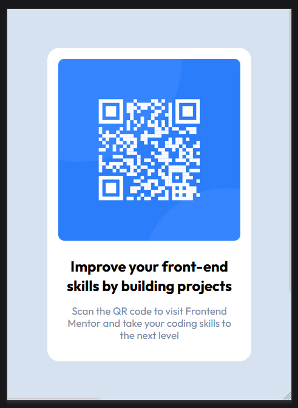

# Frontend Mentor - QR code component solution

This is a solution to the [QR code component challenge on Frontend Mentor](https://www.frontendmentor.io/challenges/qr-code-component-iux_sIO_H). Frontend Mentor challenges help you improve your coding skills by building realistic projects.

## Table of contents

- [Overview](#overview)
  - [Screenshot](#screenshot)
  - [Links](#links)
- [My process](#my-process)
  - [Built with](#built-with)
  - [What I learned](#what-i-learned)
  - [Continued development](#continued-development)
- [Author](#author)

**Note: Delete this note and update the table of contents based on what sections you keep.**

## Overview

### Screenshot



### Links

- Solution URL: [Add solution URL here](https://github.com/AshtonHarvey/qr-component)
- Live Site URL: [Add live site URL here](https://codesandbox.io/s/qr-component-qu42vz)

## My process

### Built with

- Semantic HTML5 markup
- Parcel
- SCSS
- BEM
- Mobile-first workflow

### What I learned

Ive been using small projects to de-rust and learn some new frontend dev practices. One of the practices ive been trying to learn for css is the BEM (Block Element Modifier) model. I learned how to properly name components and how to use scss to shorten the names an follow the flow of the components.

```css
.qr-component {
  font-family: "Outfit", sans-serif;
  font-size: 15px;
  max-width: 300px;
  padding: 1.1rem;
  background-color: var(--White);
  border-radius: 20px;
  text-align: center;

  &__image-container {
    margin-bottom: 1.5rem;
    &__image {
      width: 100%;
      object-fit: fill;
      border-radius: 10px;
    }
  }
```

### Continued development

For now I just want to focus on css organization and stay consistent with building projects. After that I want to take some time to de-rust with javascript. Then I would like to move on to react or angular.

## Author

- Frontend Mentor - [@AshtonHarvey](https://www.frontendmentor.io/profile/AshtonHarvey)
